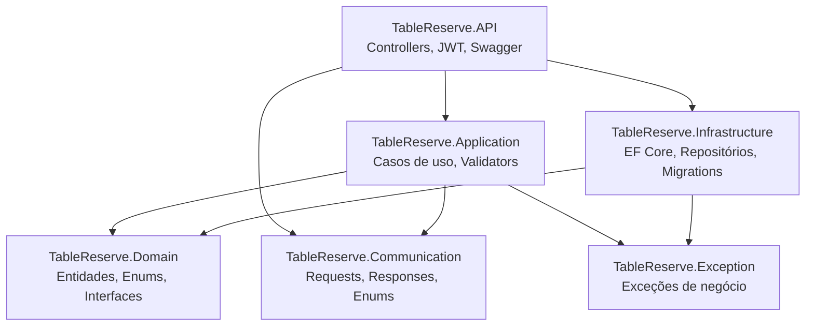
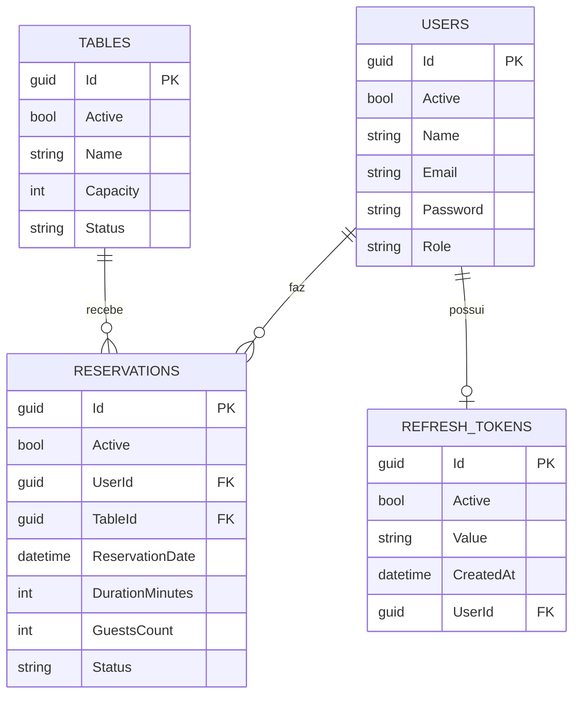

# TableReserve


API RESTful para gerenciamento de reservas de mesas de restaurante, construída em **.NET 10** seguindo os princípios de **Clean Architecture**. O sistema controla usuários, mesas e reservas, com autenticação via JWT, validação de regras de negócio (disponibilidade, capacidade, horário de funcionamento) e controle de acesso por papel (cliente/administrador).

Desafio original: [racoelho.com.br/listas/desafios/sistema-de-reservas-de-restaurante](https://racoelho.com.br/listas/desafios/sistema-de-reservas-de-restaurante)

## Índice

- [Stack técnica](#stack-técnica)
- [Arquitetura](#arquitetura)
- [Estrutura do banco de dados](#estrutura-do-banco-de-dados)
- [Regras de negócio](#regras-de-negócio)
- [Endpoints](#endpoints)
- [Como rodar o projeto](#como-rodar-o-projeto)
- [Decisões técnicas](#decisões-técnicas)
- [Roadmap](#roadmap)

## Stack técnica

| Camada | Tecnologia |
|---|---|
| Framework | .NET 10 / ASP.NET Core Web API |
| Banco de dados | MySQL |
| ORM | Entity Framework Core (`MySql.EntityFrameworkCore`) |
| Migrations | FluentMigrator (executadas automaticamente na subida da API) |
| Autenticação | JWT Bearer Token (access token + refresh token) |
| Hash de senha | Argon2 (`Konscious.Security.Cryptography.Argon2`) |
| Validação | FluentValidation |
| Mapeamento objeto-objeto | Mapster |
| Documentação de API | Swagger / OpenAPI (Swashbuckle) |
| Observabilidade | ASP.NET Core Health Checks (`/health`, com checagem real de conexão ao banco) |

## Arquitetura

O projeto segue Clean Architecture, dividido em 6 projetos:



Regra de dependência: `Domain` não depende de nada; `Communication` também não depende de nada (propositalmente — DTOs de API não conhecem entidades de domínio); `Application` depende de `Domain` e `Communication`; `Infrastructure` depende de `Domain`; `API` depende de tudo. Isso permite trocar o banco de dados ou o formato de request/response sem tocar nas regras de negócio.

## Estrutura do banco de dados



### `Users`
| Coluna | Tipo | Observação |
|---|---|---|
| Id | GUID | PK |
| Active | bool | soft delete |
| Name | varchar(250) | |
| Email | varchar(250) | único |
| Password | varchar(255) | hash Argon2 |
| Role | varchar(50) | `Customer` ou `Administrator` |

### `Tables`
| Coluna | Tipo | Observação |
|---|---|---|
| Id | GUID | PK |
| Active | bool | soft delete |
| Name | varchar(250) | |
| Capacity | int | nº máximo de pessoas |
| Status | varchar(50) | `Available`, `Reserved` ou `Inactive` — controle **manual** do administrador (ver [Decisões técnicas](#decisões-técnicas)) |

### `Reservations`
| Coluna | Tipo | Observação |
|---|---|---|
| Id | GUID | PK |
| Active | bool | soft delete |
| UserId | GUID | FK → `Users.Id` |
| TableId | GUID | FK → `Tables.Id` |
| ReservationDate | datetime | início da reserva |
| DurationMinutes | int | 20 a 120, em múltiplos de 20 |
| GuestsCount | int | nº de pessoas |
| Status | varchar(50) | `Active` ou `Cancelled` |

### `RefreshTokens`
| Coluna | Tipo | Observação |
|---|---|---|
| Id | GUID | PK |
| Active | bool | soft delete |
| Value | varchar(255) | token opaco (32 bytes aleatórios, base64) |
| CreatedAt | datetime | usado pra calcular expiração (7 dias fixos) |
| UserId | GUID | FK → `Users.Id` — no máximo 1 refresh token ativo por usuário |

## Regras de negócio

**Usuários**
- Registro exige nome, e-mail (único) e senha (mín. 8 caracteres, com maiúscula, minúscula, número e caractere especial).
- Senha é armazenada com hash Argon2, nunca em texto puro.
- Login retorna um par de tokens: um **access token** (JWT, curta duração, carrega a `Role` do usuário como claim) e um **refresh token** (string opaca, 7 dias de validade). Rotas de mesas, reservas e perfil exigem o access token válido.
- `POST /auth/token/refresh` troca um refresh token válido por um novo par de tokens. O refresh token antigo é invalidado nesse momento (rotação: só existe um refresh token ativo por usuário por vez) — usar um refresh token já trocado ou expirado derruba a sessão, exigindo login de novo.

**Mesas**
- Criar e atualizar mesa é restrito a usuários com papel `Administrator` (checado via `[Authorize(Roles = "Administrator")]`, usando a `Role` presente no JWT).
- Não existe endpoint de remoção de mesa — o controle de disponibilidade é feito via `Status` (colocar como `Inactive` tem o mesmo efeito prático de "tirar de operação", sem apagar o histórico de reservas associado).
- `Status` é um controle manual do admin — não muda sozinho quando uma reserva é criada ou cancelada (ver [Decisões técnicas](#decisões-técnicas) pra entender por quê).

**Reservas**
- Só pode reservar mesa com `Status = Available`.
- Nº de pessoas não pode exceder a capacidade da mesa.
- Duração deve ser 20, 40, 60, 80, 100 ou 120 minutos.
- Data/hora da reserva deve ser futura e cair dentro do horário de funcionamento (08:00–23:00) — tanto o início quanto o fim (`ReservationDate + DurationMinutes`) precisam caber nesse intervalo.
- Não pode haver sobreposição de horário entre reservas ativas na mesma mesa.
- Cancelamento só pode ser feito pelo próprio usuário que criou a reserva, e só se ela ainda estiver ativa.

## Endpoints

### Autenticação
| Método | Rota | Autenticação | Descrição |
|---|---|---|---|
| POST | `/users/register` | Não | Registro de novo usuário |
| POST | `/auth/login` | Não | Login, retorna access token + refresh token |
| POST | `/auth/token/refresh` | Não* | Troca um refresh token válido por um novo par de tokens |
| GET | `/users/me` | JWT | Dados do usuário autenticado |

\* Não exige header de autenticação — a validação é do refresh token enviado no corpo da requisição, não do access token.

### Mesas
| Método | Rota | Autenticação | Descrição |
|---|---|---|---|
| GET | `/tables` | JWT | Lista todas as mesas ativas |
| POST | `/tables/register` | JWT + Administrator | Cria mesa |
| PATCH | `/tables/{id}` | JWT + Administrator | Atualiza nome, capacidade e status |

### Reservas
| Método | Rota | Autenticação | Descrição |
|---|---|---|---|
| POST | `/reservations/register` | JWT | Cria reserva |
| GET | `/reservations` | JWT | Lista as reservas do usuário autenticado |
| PATCH | `/reservations/{id}/cancel` | JWT | Cancela reserva própria |

Documentação interativa (Swagger UI) disponível em `/swagger` quando a API roda em ambiente de desenvolvimento — já inclui suporte a Bearer token direto na interface (clique em "Authorize" e cole só o token, sem precisar digitar "Bearer" antes).

## Como rodar o projeto

### Pré-requisitos
- [.NET 10 SDK](https://dotnet.microsoft.com/download)
- MySQL rodando localmente (ou em container)

### Passos

1. Clone o repositório:
```bash
   git clone https://github.com/GuilhAndrad/TableReserve.git
   cd TableReserve
```

2. Configure os segredos locais. Copie o arquivo de exemplo e preencha com seus próprios valores:
```bash
   cp src/back/TableReserve.API/appsettings.Development.json.example src/back/TableReserve.API/appsettings.Development.json
```
   Edite `DbConnection` (string de conexão do seu MySQL) e `Jwt:SigningKey` (uma string aleatória longa — pode gerar com `openssl rand -base64 32`, por exemplo).

3. Rode a API:
```bash
   dotnet run --project src/back/TableReserve.API
```
   As migrations do banco (`Users`, `Tables`, `Reservations`, `RefreshTokens`) rodam automaticamente na subida da aplicação — não precisa rodar nenhum comando manual de migration.

4. Acesse a documentação interativa em `https://localhost:7116/swagger` (ou a porta exibida no terminal).

5. `GET /health` reporta `200 OK` se a API e a conexão com o banco estiverem saudáveis, ou `503` caso contrário — útil pra scripts de inicialização (Docker, CI) esperarem o banco ficar pronto antes de mandar tráfego de verdade.

## Decisões técnicas

Algumas decisões que fugiram do requisito literal do desafio, e o porquê:

- **Reserva por janela de horário, não só por status da mesa.** O enunciado original sugere que a mesa fica "reservada" (e bloqueada) assim que associada a uma reserva. Isso impediria que uma mesa tivesse reservas futuras em horários diferentes no mesmo dia. Optei por um modelo de janela de horário: cada reserva tem `ReservationDate` + `DurationMinutes`, e a disponibilidade é calculada verificando sobreposição contra outras reservas ativas da mesma mesa — não contra um campo de status estático.
- **`Table.Status` é controle manual do admin, não automático.** Como consequência direta da decisão acima, o status da mesa (`Available`/`Reserved`/`Inactive`) não muda sozinho quando uma reserva é criada ou cancelada — ele serve como um bloqueio manual (por exemplo, tirar uma mesa de operação por manutenção). A disponibilidade real para reservar é sempre calculada contra a tabela de reservas.
- **Duração fixa em incrementos de 20 minutos (20–120).** Inicialmente a duração era livre, mas isso permitia reservas de poucos minutos (inútil) ou de horas seguidas (trava a mesa à toa). Restringir a incrementos fixos simplifica a experiência e evita esses extremos.
- **Autorização de administrador via `Role` no JWT + `[Authorize(Roles = "Administrator")]`.** Inicialmente a `Role` não estava no token — cada caso de uso buscava o usuário logado no banco e comparava o papel manualmente. Isso mudou: o requisito do desafio pede explicitamente "uso de JWT para... controlar permissões de usuários", então a forma correta de atender isso é o próprio token carregar a informação de permissão, com o framework decidindo acesso antes mesmo da requisição chegar no caso de uso — não o caso de uso decidindo depois de já ter entrado. Como efeito colateral, os casos de uso de mesas ficaram mais simples (perderam a dependência de `ILoggedUser` que só existia pra essa checagem) e não tem mais uma consulta extra ao banco por requisição administrativa. O trade-off: se a `Role` de um usuário mudar, o token antigo continua valendo com o papel antigo até expirar — por isso o access token tem vida curta (configurável via `Jwt:ExpirationTimeMinutes`) e depende do refresh token pra renovar.
- **Refresh token com rotação, um único token ativo por usuário.** A cada uso (login ou refresh), o refresh token anterior do usuário é apagado e um novo é gerado — não existe lista de múltiplos tokens válidos simultâneos. Isso significa que logar num segundo dispositivo invalida o refresh token do primeiro (mas não o access token já emitido, que continua valendo até expirar). É uma limitação deliberada de simplicidade: suportar múltiplas sessões simultâneas exigiria um token por dispositivo/sessão, o que não foi pedido pelo desafio.
- **`Communication` não depende de `Domain`.** Os enums usados nos DTOs (`TableStatus`, `ReservationStatus`) são cópias dos enums de `Domain`, não o mesmo tipo reaproveitado. Isso mantém a camada de contratos de API isolada das entidades internas. A conversão entre os dois é feita via Mapster, com os `TypeAdapterConfig` centralizados em `MapsterConfiguration`.
- **Soft delete via coluna `Active`.** Usuários e mesas nunca são apagados fisicamente, preservando histórico e integridade referencial com reservas antigas.

## Roadmap

Funcionalidades planejadas como próximos passos (fora do escopo inicial do desafio):

- [ ] **Testes automatizados** — cobertura do essencial (regras de negócio dos casos de uso de mesas e reservas), não 100% de cobertura.
- [ ] **Coleção Postman** com exemplos de request/response.
- [ ] **Docker Compose** com API + MySQL prontos para subir com um comando.

## Licença

Este projeto está sob a licença MIT — veja [LICENSE.txt](LICENSE.txt).
